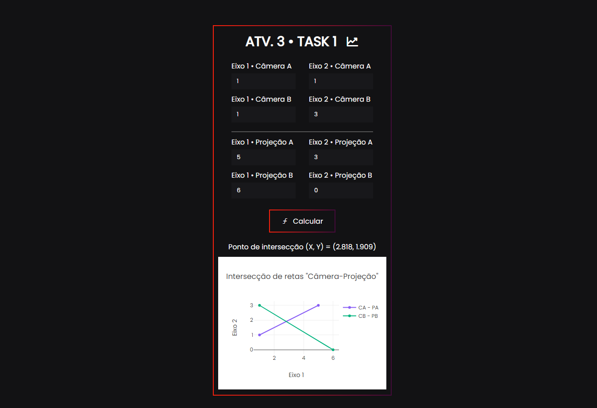

<h1 align="center">
  Fundamentals of Biomechanical Informatic
  <br>
  <em>University of São Paulo • 2022</em>
</h1>


<br>

<h2>
JavaScript code
</h2>

```javascript
function calculateIntersectionPoint(){
  const divR = document.getElementById('result')
  const divG = document.getElementById('graph')

  var xA = window.document.getElementById("xA").value;
  var yA = window.document.getElementById("yA").value;
  var xB = window.document.getElementById("xB").value;
  var yB = window.document.getElementById("yB").value;
  var xPA = window.document.getElementById("xPA").value;
  var yPA = window.document.getElementById("yPA").value;
  var xPB = window.document.getElementById("xPB").value;
  var yPB = window.document.getElementById("yPB").value;

  if(xA == '' || yA == '' || xB == '' || yB == '' || xPA == '' || yPA == '' || xPB == '' || yPB == '') {
    alert('Preencha todos os campos.');
  }
  else {
    var xA = Number(xA)
    var yA = Number(yA);
    var xB = Number(xB);
    var yB = Number(yB);
    var xPA = Number(xPA);
    var yPA = Number(yPA);
    var xPB = Number(xPB);
    var yPB = Number(yPB);

    var A = [xA, yA];
    var B = [xB, yB];
    var PA = [xPA, yPA];
    var PB = [xPB, yPB];

    var slope_line_A = (A[1] - PA[1])/(A[0] - PA[0]);
    var slope_line_B = (B[1] - PB[1])/(B[0] - PB[0]);

    var intersec_X = (- (slope_line_B * B[0]) + B[1] + (slope_line_A * A[0]) - A[1])/(slope_line_A - slope_line_B);
    var intersec_Y = (slope_line_A * intersec_X) - (slope_line_A * A[0]) + A[1];

    var CA = {
        x: [A[0], PA[0]],
        y: [A[1], PA[1]],
        name: 'CA - PA',
        line: {
            color: '#885df5'
        }
    };

    var CB = {
        x: [B[0], PB[0]],
        y: [B[1], PB[1]],
        name: 'CB - PB',
        line: {
            color: '#00B37E'
        }
    };

    var data = [CA, CB];

    var layout = {
        width: 380,
        height: 300,

        xaxis: {
            title: "Eixo 1"
        },
        yaxis: {
            title: "Eixo 2"
        },

        title: 'Intersecção de retas "Câmera-Projeção"',

        showlegend: true,

        font: {
            family: 'Poppins'
        }
    };

    divR.innerHTML = `Ponto de intersecção (X, Y) = (${intersec_X.toFixed(3)}, ${intersec_Y.toFixed(3)})`;
    Plotly.newPlot('graph', data, layout);
  }    
}
```